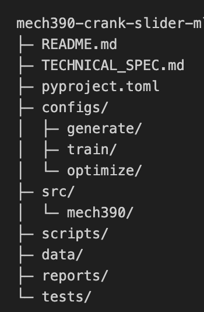

# Data-Driven Design of an Offset Crank–Slider Mechanism  

**MECH 390 – Machine Learning–Assisted Mechanical Design**

---

## 1. What this repository is about

This repository implements a physics-based data generation and machine learning workflow for the design and evaluation of an offset crank–slider mechanism.

The goal is to automate what is traditionally done by hand in mechanical design:

- select a mechanism geometry,
- verify that it satisfies motion requirements,
- evaluate forces and stresses,
- and determine whether the design is structurally acceptable.

Instead of evaluating a small number of designs manually, this project generates large datasets using exact kinematics and dynamics, then trains a machine learning model to rapidly evaluate new designs.

Physics governs the behavior of the system.  
Machine learning is used only to learn patterns from physically valid data.

---

## 2. High-level workflow

The project is intentionally divided into two stages:

1. **2D kinematic feasibility**
2. **3D embodiment, dynamics, and stress evaluation**

This separation ensures that expensive stress calculations are only performed on mechanisms that are already valid from a motion standpoint.

---

## 3. Stage 1 – 2D kinematic feasibility

In Stage 1, the mechanism is treated as a purely planar offset crank–slider.

Only geometry and motion are considered.  
No forces, masses, or stresses are evaluated at this stage.

### Process

1. Rod length `l` and offset `e` are sampled from configured ranges, with pre-feasibility filtering applied before sampling to avoid wasted draws.
2. The crank radius `r` is solved **analytically** (exact closed-form) from the target ROM:

   ```
   r = (S/2) * sqrt( (4(l²−e²) − S²) / (4l² − S²) )
   ```

   where `S = ROM`. The following conditions are checked before applying the formula:
   - `e < l` — a valid triangle must exist
   - `S < 2l` — keeps the denominator positive
   - `S < 2√(l²−e²)` — keeps the numerator positive (physical maximum stroke)
   - `l > r + |e|` — full-rotation geometry feasibility

   After solving `r`, Stage 1 also enforces branch feasibility introduced by squared algebra:
   - `l² + r² − e² − S²/2 >= 0`
   - residual check against the original ROM expression:
     `|ROM_computed − ROM_target| <= ROM_tolerance` (currently ±0.5 mm = 0.0005 m)

3. Optional user-defined constraint expressions are evaluated against `(r, l, e, S)` to allow additional custom filtering.
4. Dead-center positions are found via robust numerical root-finding (Brent's method) on the velocity equation.
5. The forward and return crank-angle spans are evaluated.
6. The quick return ratio is computed from these angle spans.
7. The geometry is retained only if:
   - the ROM target is met within tolerance, and
   - the quick return ratio lies within the acceptable range.

This stage produces a set of kinematically valid two-dimensional mechanisms, emitted as a
streaming iterator or collected into a list. The generator keeps drawing candidate batches
until exactly `n_samples` valid designs are produced (not just attempted).

---

## 4. Stage 2 – 3D embodiment, dynamics, and stress evaluation

Only mechanisms that pass Stage 1 are evaluated further.

In Stage 2, each valid 2D mechanism is expanded into a family of three-dimensional designs.

### Process

1. For each valid `(r, l, e)` geometry, many 3D variants are generated (controlled by `sampling.n_variants_per_2d`).
2. Widths, thicknesses, and pin diameters are sampled from configuration ranges using the method specified in `sampling.method`.
3. Geometric feasibility constraints are enforced:
   - `width_r > pin_diameter_A`
   - `width_r > pin_diameter_B`
   - `width_l > pin_diameter_B`
   - `width_l > pin_diameter_C`
4. Mass properties are evaluated through the modular `mass_properties` API:
   masses, center-of-gravity vectors, mass moments, and area moments.
5. Dynamic forces are evaluated at every 15° of crank rotation using a planar Newton–Euler 8×8 linear solve that returns:
   - joint reactions at A, B, and C (`F_A`, `F_B`, `F_C`)
   - slider normal/friction (`N`, `F_f`, kinetic Coulomb)
   - required crank torque (`tau_A`)
   - compatibility alias `F_O = F_A`
6. Normal and shear stresses are computed throughout the cycle. *(stresses.py stub — not yet fully implemented)*
7. The maximum stress values over the full cycle are extracted.
8. Each design is classified as pass or fail based on allowable stress limits (`sigma_allow`, `tau_allow`, `safety_factor`).

This stage generates the dataset used for machine learning.

---

## 5. Why the two-stage approach is used

This structure reflects standard mechanical design practice:

1. First ensure the mechanism functions kinematically.
2. Then evaluate structural performance and strength.
3. Finally, optimize or automate design decisions.

From a computational standpoint:

- kinematic checks are inexpensive and eliminate invalid designs early,
- stress analysis is reserved for physically meaningful cases,
- overall data generation becomes scalable and efficient.

---

## 6. Repository structure

```
mech390-crank-slider-ml/
├─ configs/           # Experiment definitions (YAML files)
│  ├─ generate/       # Data generation configs (baseline.yaml, aggressive.yaml, test_small.yaml)
│  ├─ train/          # ML training configs (regression.yaml, classifier.yaml)
│  └─ optimize/       # Optimization configs (search.yaml)
├─ src/mech390/       # Physics, data generation, and ML code
│  ├─ config.py       # Config loading and validation utilities
│  ├─ physics/        # Kinematics, dynamics, mass properties, engine, stresses
│  ├─ datagen/        # Stage 1 & 2 pipeline, sampling, generate orchestrator
│  └─ ml/             # Feature engineering, models, training, inference (stubs)
├─ scripts/           # Executable entry points
│  ├─ generate_dataset.py
│  ├─ preview_stage1.py     # Stage 1 CSV preview with CLI
│  ├─ preview_stage2.py     # Stage 2 CSV preview with CLI (includes mass properties)
│  ├─ debug_stage1.py       # Quick Stage 1 debug runner
│  ├─ test_datagen.py       # Quick inline-config generation test
│  ├─ train_model.py
│  └─ optimize_config.py
├─ data/              # Generated datasets and trained models
│  └─ stage1_preview/ # Output of preview_stage1.py
├─ tests/             # Unit tests (test_datagen_units.py)
├─ reports/           # Plots and run summaries
└─ README.md
```

All experiments are defined through configuration files.  
The core code does not need to be modified to run new studies.

---

## 7. Configuration files

Configuration files describe how data is generated and how models are trained.

They define:

- `material`: fixed density `rho`, yield stresses (currently informational)
- `geometry`: sampling ranges for `r`, `l`, `e`; grouped `widths`, `thicknesses`, `pin_diameters`; fixed `slider` dimensions
- `operating`: `RPM`, `ROM`, `ROM_tolerance` (±0.5 mm = 0.0005 m), `QRR` bounds, `mu` (friction), `TotalCycles`
- `sampling`: `method` (`latin_hypercube` or `random`), `n_samples` (**target number of VALID Stage-1 designs** to produce — the generator batches draws until this many pass), `n_variants_per_2d`, optional `stage2_max_attempts_per_2d`, optional `constraints` list
- `manufacturing`: `resolution_mm` (rounding resolution for r/l/e/widths/thicknesses; default 1.0 mm), `pin_resolution_mm` (rounding resolution for pin diameters; default 0.1 mm)
- `sweep`: `theta_step_deg` (fixed at 15°)
- `limits`: `sigma_allow`, `tau_allow`, `safety_factor`
- `output`: CSV path definitions

Configuration loading normalizes numeric values (including scientific notation) and validates `{min, max}` ranges before sampling.

---

## 8. Nomenclature

| Variable | Meaning | Units |
|---|---|---|
| `r` | Crank radius (link O-B center distance) | m |
| `l` | Connecting rod length (link B-C center distance) | m |
| `e` (`D`) | Offset between crank centerline and slider axis | m |
| `theta` (`θ`) | Crank angle | rad |
| `omega` (`ω`) | Crank angular speed | rad/s |
| `alpha_r` (`α_r`) | Crank angular acceleration | rad/s² |
| `phi` (`φ`) | Connecting-rod angle | rad |
| `alpha_l` (`α_l`) | Connecting-rod angular acceleration | rad/s² |
| `ROM` / `S` | Slider range of motion (stroke) | m |
| `QRR` | Quick-return ratio (forward/return angle ratio) | dimensionless |
| `x_C` | Slider x-position | m |
| `v_Cx` | Slider x-velocity | m/s |
| `a_Cx` | Slider x-acceleration | m/s² |
| `mass_crank` (`m_r`) | Crank mass | kg |
| `mass_rod` (`m_l`) | Rod mass | kg |
| `mass_slider` (`m_s`) | Slider mass | kg |
| `width_r` (`w_r`) | Crank link width | m |
| `thickness_r` (`t_r`) | Crank link thickness | m |
| `width_l` (`w_l`) | Rod link width | m |
| `thickness_l` (`t_l`) | Rod link thickness | m |
| `pin_diameter_A` (`d_A`) | Pin diameter at joint A | m |
| `pin_diameter_B` (`d_B`) | Pin diameter at joint B | m |
| `pin_diameter_C` (`d_C`) | Pin diameter at joint C | m |
| `I_mass_crank_cg_z` | Crank mass moment of inertia about CG z-axis | kg·m² |
| `I_mass_rod_cg_z` | Rod mass moment of inertia about CG z-axis | kg·m² |
| `I_mass_slider_cg_z` | Slider mass moment of inertia about CG z-axis | kg·m² |
| `I_area_crank_yy`, `I_area_crank_zz` | Area moments of inertia of crank cross-section | m⁴ |
| `I_area_rod_yy`, `I_area_rod_zz` | Area moments of inertia of rod cross-section | m⁴ |
| `I_area_slider_yy`, `I_area_slider_zz` | Area moments of inertia of slider cross-section | m⁴ |
| `F_A`, `F_B`, `F_C` | Joint reaction force vectors at joints A, B, C | N |
| `F_O` | Compatibility alias for `F_A` | N |
| `N` | Slider normal reaction from guide | N |
| `F_f` | Slider friction force (kinetic Coulomb model) | N |
| `tau_A` (`τ_A`, `T`) | Motor torque applied on the crank at A (required drive torque) | N·m |
| `mu` (`μ`) | Coefficient of friction | dimensionless |
| `rho` (`ρ`) | Material density | kg/m³ |
| `g` | Gravitational acceleration | m/s² |
| `sigma_max` | Maximum normal stress over a full cycle | Pa |
| `tau_max` | Maximum shear stress over a full cycle | Pa |
| `sigma_allow` | Allowable normal stress limit | Pa |
| `tau_allow` | Allowable shear stress limit | Pa |
| `utilization` | `max(sigma_max/sigma_allow, tau_max/tau_allow)` | dimensionless |
| `pass_fail` | Design label (1 = pass, 0 = fail) | binary |
| `RPM` | Crank rotational speed (input setting) | rev/min |

---

## 9. Role of machine learning

Machine learning does not replace physical modeling in this project.

Instead, it is used to:
 • approximate the relationship between geometry and peak stress,
 • rapidly classify designs as likely pass or fail,
 • enable fast exploration of large design spaces.

All training data is generated using physics-based equations.

⸻

## 10. Implementation status

| Module | Status |
|---|---|
| `config.py` | ✅ Complete — loads YAML, normalizes numerics, validates ranges, extracts Stage-2 param ranges and sampling settings |
| `kinematics.py` | ✅ Complete — slider & crank pin positions/velocities/accelerations (all `np.ndarray([x,y])`), rod angle/angular velocity/acceleration, dead centers via Brent root-finding, ROM & QRR |
| `dynamics.py` | ✅ Complete — Newton–Euler 8×8 linear solve, returns `F_A/B/C`, `N`, `F_f`, `tau_A`, `F_O`; ill-conditioning guard |
| `mass_properties.py` | ✅ Complete — link/slider mass, CG helpers, mass MOI, area MOI (Iyy/Izz), `MassPropertiesResult` dataclass, `compute_design_mass_properties` aggregator |
| `engine.py` | ✅ Complete — 15° sweep, calls kinematics→dynamics; stresses plugged in as `0.0` placeholder pending `stresses.py` |
| `stresses.py` | 🔲 Stub — only imports `dynamics`; stress formulas not yet implemented |
| `fatigue.py` | 🔲 Empty — reserved for future fatigue analysis |
| `stage1_kinematic.py` | ✅ Complete — pre-feasibility sampling, constrained (l,e) candidate generation, closed-form `r` solver, full acceptance pipeline, streaming iterator + list API |
| `stage2_embodiment.py` | ✅ Complete — streaming 3D expansion, width/pin constraint enforcement; mass properties and stress calls are TODO stubs |
| `sampling.py` | ✅ Complete — `sample_scalar`, `LatinHypercubeSampler` (LHS via `scipy.stats.qmc`), `get_sampler` factory |
| `generate.py` | ✅ Complete — `generate_dataset` orchestrator, physics evaluation with fallback mock, pass/fail labeling, `DatasetResult` container |
| `preview_stage1.py` | ✅ Complete — CLI script for Stage 1 preview; writes CSV, prints stats; supports `--config`, `--seed`, `--out-dir` |
| `preview_stage2.py` | ✅ Complete — CLI script for Stage 2 preview; runs Stage 1 → Stage 2, computes mass properties, writes 27-column CSV; supports `--config`, `--seed`, `--out-dir`, `--max-2d` |
| `debug_stage1.py` | ✅ Complete — quick debug runner using baseline config |
| `generate_dataset.py` | 🔲 Stub — imports only |
| `train_model.py` | 🔲 Stub — imports only |
| `optimize_config.py` | 🔲 Stub — imports only |
| `ml/` | 🔲 Stubs — `features.py`, `models.py`, `train.py`, `infer.py` |

⸻

# Repository File Tree and Responsibilities (Authoritative)

Each file below is listed **once** with its responsibility stated **inline**.

---



## File and Directory Responsibilities

| Path | Description |
|-----|-------------|
| `README.md` | High-level project overview, workflow, nomenclature, and implementation status |
| `instructions.md` | Authoritative technical specification for developers and AI agents |
| `configs/` | YAML experiment definitions (no executable logic) |
| `configs/generate/baseline.yaml` | Full-scale generation config (20M samples, LHS, 5 variants/2D) |
| `configs/generate/test_small.yaml` | Small test config (1000 samples, LHS, 5 variants/2D) |
| `configs/generate/aggressive.yaml` | Aggressive/wide-range generation config |
| `configs/train/regression.yaml` | ML regression training config |
| `configs/train/classifier.yaml` | ML classifier training config |
| `configs/optimize/search.yaml` | ML-based design optimization config |
| `src/mech390/config.py` | Config loading (`load_config`, `get_baseline_config`), numeric normalization, range validation, Stage-2 param range and sampling settings extraction |
| `src/mech390/physics/kinematics.py` | Slider & crank pin position/velocity/acceleration (all `np.ndarray([x,y])`); rod angle/angular velocity/acceleration; dead-center detection via Brent root-finding; ROM and QRR metrics |
| `src/mech390/physics/dynamics.py` | Newton–Euler 8×8 joint-reaction solver (`F_A/B/C`, `N`, `F_f`, `tau_A`) with compatibility alias `F_O`; condition number guard; `joint_reaction_forces` backward-compatible wrapper |
| `src/mech390/physics/mass_properties.py` | Link and slider mass, volume, and MOI helpers; `link_area_moments_gross` / `slider_area_moments_gross` for cross-section properties; kinematic COG helpers (`crank_cog`, `rod_cog`, `slider_cog`); `MassPropertiesResult` dataclass; `compute_design_mass_properties` design-level aggregator |
| `src/mech390/physics/stresses.py` | **Stub** — stress formulas not yet implemented |
| `src/mech390/physics/fatigue.py` | **Empty** — reserved for future fatigue analysis |
| `src/mech390/physics/engine.py` | 15° crank-angle sweep; orchestrates kinematics → dynamics → stresses (placeholder); tracks peak sigma and tau; returns `sigma_max`, `tau_max`, crank angles at maxima, `valid_physics` flag |
| `src/mech390/datagen/sampling.py` | `sample_scalar` utility; `LatinHypercubeSampler` class using `scipy.stats.qmc`; `get_sampler` factory (supports `latin_hypercube` and `random`) |
| `src/mech390/datagen/stage1_kinematic.py` | Pre-feasibility constrained (l,e) candidate generation; closed-form `solve_for_r_given_rom`; branch-feasibility and residual ROM checks; optional user constraint expressions; dead-center and QRR verification; `iter_valid_2d_mechanisms` (streaming) and `generate_valid_2d_mechanisms` (list) |
| `src/mech390/datagen/stage2_embodiment.py` | Streaming 3D expansion `iter_expand_to_3d`; width/pin feasibility constraints; seed diversification per 2D design; `expand_to_3d` list wrapper; mass properties and stress calls are TODO stubs |
| `src/mech390/datagen/generate.py` | `generate_dataset` orchestrator; streaming Stage-2 consumption; physics evaluation with fallback mock; `_apply_limits` for utilization and pass/fail; `DatasetResult` container |
| `src/mech390/ml/features.py` | Feature selection and scaling (**stub**) |
| `src/mech390/ml/models.py` | ML model architectures (**stub**) |
| `src/mech390/ml/train.py` | Training loop (**stub**) |
| `src/mech390/ml/infer.py` | Prediction utilities (**stub**) |
| `scripts/generate_dataset.py` | CLI entry point for dataset generation (**stub**) |
| `scripts/preview_stage1.py` | CLI script: runs Stage 1, streams results to CSV; supports `--config`, `--seed`, `--out-dir`; prints descriptive statistics |
| `scripts/preview_stage2.py` | CLI script: runs Stage 1 → Stage 2, computes mass properties inline, streams 27-column results to CSV; supports `--config`, `--seed`, `--out-dir`, `--max-2d`; prints descriptive statistics |
| `scripts/debug_stage1.py` | Quick debug runner for Stage 1 using baseline config; prints first 5 designs and statistics |
| `scripts/train_model.py` | CLI entry point for ML training (**stub**) |
| `scripts/optimize_config.py` | CLI entry point for ML-based design evaluation (**stub**) |
| `tests/test_datagen_units.py` | Unit tests for data generation pipeline |
| `data/stage1_preview/stage1_geometries.csv` | Output CSV from `preview_stage1.py` (columns: r, l, e, ROM, QRR, theta_min, theta_max) |
| `data/stage2_preview/stage2_designs.csv` | Output CSV from `preview_stage2.py` (27 columns: Stage-1 + 3D geometry + mass properties) |
